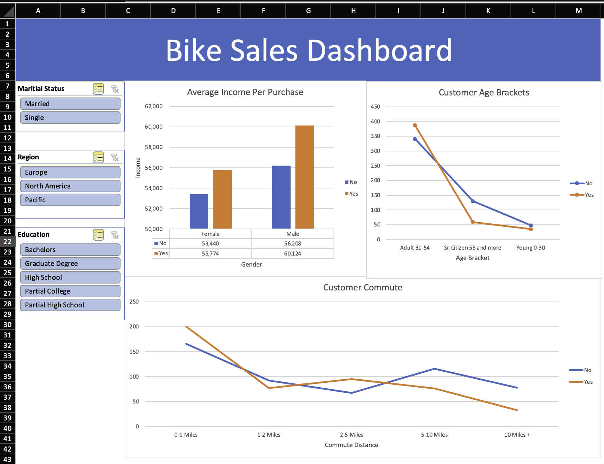

# Bike Buyers Analysis Project

## Overview

This project provides an analysis of factors affecting bike purchase decisions using a sample dataset. It aims to help stakeholders understand customer demographics and purchasing behaviors. The dataset includes various attributes related to individuals such as income, marital status, occupation, and whether they purchased a bike. This project is suitable for those interested in exploring data analytics and using pivot tables or dashboards to derive insights from data.

## Dataset Description

The dataset comprises multiple sheets, each containing specific information about the customers and the analysis. The main sheets include:

1. **bike_buyers**: 
   - This is the main dataset used for analysis. It contains demographic information of individuals, including:
     - `ID`: Unique identifier for each individual.
     - `Marital Status`: Marital status of the individual (Married or Single).
     - `Gender`: Gender of the individual.
     - `Income`: Annual income of the individual.
     - `Children`: Number of children.
     - `Education`: Education level (e.g., Bachelors, Graduate Degree).
     - `Occupation`: Type of occupation (e.g., Clerical, Professional, Management).
     - `Home Owner`: Homeownership status (Yes/No).
     - `Cars`: Number of cars owned.
     - `Commute Distance`: Distance traveled for daily commute.
     - `Region`: Geographic region (e.g., Europe, Pacific, North America).
     - `Age`: Age of the individual.
     - `Purchased Bike`: Indicator if the individual has purchased a bike (Yes/No).

2. **Working Sheet**:
   - This sheet is an extended version of `bike_buyers` with additional derived data such as:
     - `Age Bracket`: Categorizes age into groups like "Adult 31-54" and "Sr. Citizen 55 and more".

3. **Sheet4**:
   - A similar dataset as `bike_buyers` but focused on individuals from North America, which can be useful for regional analysis.

4. **Pivot Tables**:
   - This sheet contains pivot tables summarizing key information from the main dataset. It appears to show metrics like average income categorized by different attributes.

5. **Dashboard**:
   - This sheet is intended for visual representation of key metrics and findings in a summarized form, providing insights from the analysis of bike purchases.

## Dashboard Preview

Below is a preview of the bike sales dashboard included in the project:

> *Note*: Please make sure to upload the image (`bike_sales_dashboard.png`) to the `images` folder in your repository so that it can be properly referenced here.

## Usage

### Analysis Goals
- Understand the factors that influence bike purchasing decisions.
- Identify key demographics that are more likely to purchase a bike.
- Create a data-driven approach to targeting marketing efforts for bike sales.

### Features
- **Data Analysis**: Use Excel functions to clean, filter, and analyze data on potential bike buyers.
- **Pivot Tables**: Generate summarized views to identify trends and relationships between different demographics and purchasing behaviors.
- **Dashboard**: Visual representations of the key findings, designed to communicate insights in an easy-to-understand manner.

## Project Structure

- **Data Cleaning**: Initial data cleaning steps are performed in the `Working Sheet` to standardize data and create new derived columns like `Age Bracket`.
- **Data Exploration**: The data is further explored to understand relationships between variables, such as income levels, age brackets, and bike purchasing trends.
- **Pivot Tables and Dashboard**: Summarized data insights are provided using pivot tables and dashboards to offer a quick overview of the trends and key findings.

## How to Use This Project

1. **Download the Excel File**: Start by downloading the project dataset, which includes all the necessary sheets.
2. **Navigate Through Sheets**:
   - Explore the **bike_buyers** sheet to understand the individual data points.
   - Use the **Working Sheet** to see extended information and additional categorizations.
   - **Sheet4** is useful for a more specific focus on a geographic region.
   - View the **Pivot Tables** to gain a summarized perspective on the data.
   - Refer to the **Dashboard** for visual insights.
3. **Analyze the Data**: You can use Excel tools to create new charts, graphs, and even add additional pivot tables for deeper analysis.

## Technologies Used

- **Microsoft Excel**: All data analysis, pivot tables, and dashboards are created using Excel. This includes cleaning, transforming, analyzing data, and creating visualizations.

## Potential Improvements

- **Advanced Analysis**: This dataset can be further analyzed using Python or R for more advanced statistical insights and machine learning predictions.
- **Interactive Dashboards**: Tools like Power BI or Tableau could be used to create interactive dashboards for more dynamic analysis.
- **Feature Engineering**: Additional derived features could be created, such as calculating a "Bike Affordability Score" based on income and number of children.

## License

This project is licensed under the MIT License - see the LICENSE file for details.

## Conclusion

The "Bike Buyers Analysis Project" aims to understand the factors affecting customer decisions to purchase bikes. This dataset serves as a foundation for learning data analysis, generating insights, and exploring consumer behavior through a real-world example.

